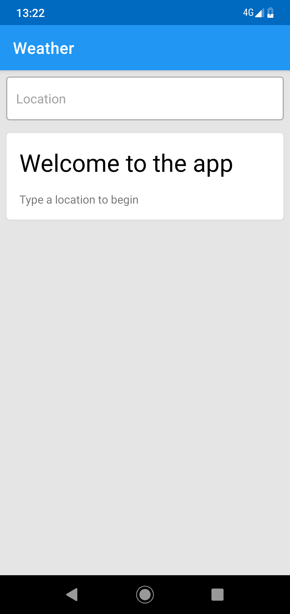
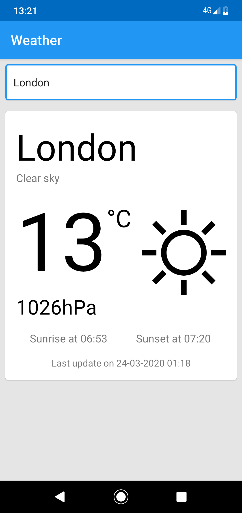
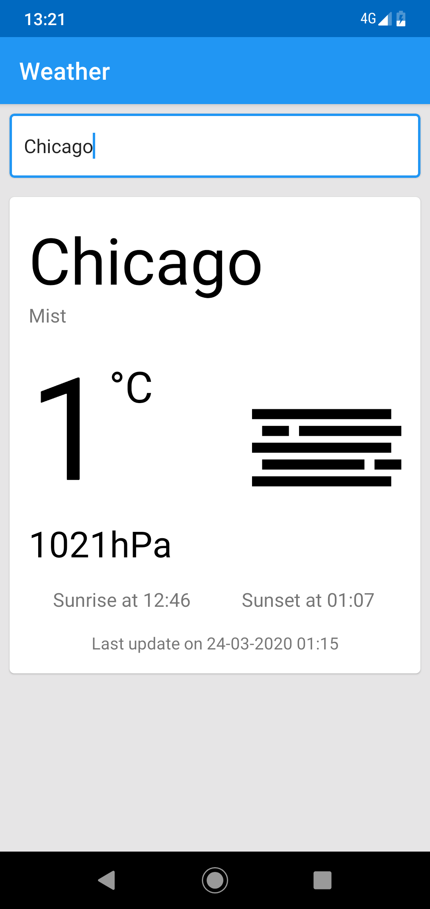

# weather-app
Weather app for Android providing a functionality to check the current weather in a location typed.

  

## Tech stack

- [Android Studio](https://developer.android.com/studio)
- [MVVM](https://en.wikipedia.org/wiki/Model%E2%80%93view%E2%80%93viewmodel)
- [Material Design](https://material.io/design/)
- [Retrofit2](https://square.github.io/retrofit/)
- [Gson](https://github.com/square/retrofit/tree/master/retrofit-converters/gson)
- [Okhttp3](https://square.github.io/okhttp/)

## Credits

-  Weather icons made by [Freepik](https://www.flaticon.com/authors/freepik) from [www.flaticon.com](https://www.flaticon.com/).
-  Weather data provided by [OpenWeather](https://openweathermap.org/)

## Dev environment preparation

Before building, an API key needs to be provided in order for OpenWeather to allow weather data access. To provide the key, follow these steps:
1. Create an account at https://openweathermap.org/api
2. Get an API key from your account
3. Create file named `local.properties` in the project root directory
4. Paste the following content to the file:
```
sdk.dir=C\:\\Users\\SQ019\\AppData\\Local\\Android\\Sdk
api_key="YOUR_KEY"
```
5. Replace *YOUR_KEY* with the key from the point 2.

## App instalation

To install dev verion of the app you need to have a device plugged or an emulator installed, both with Android 4.4 or higher.
